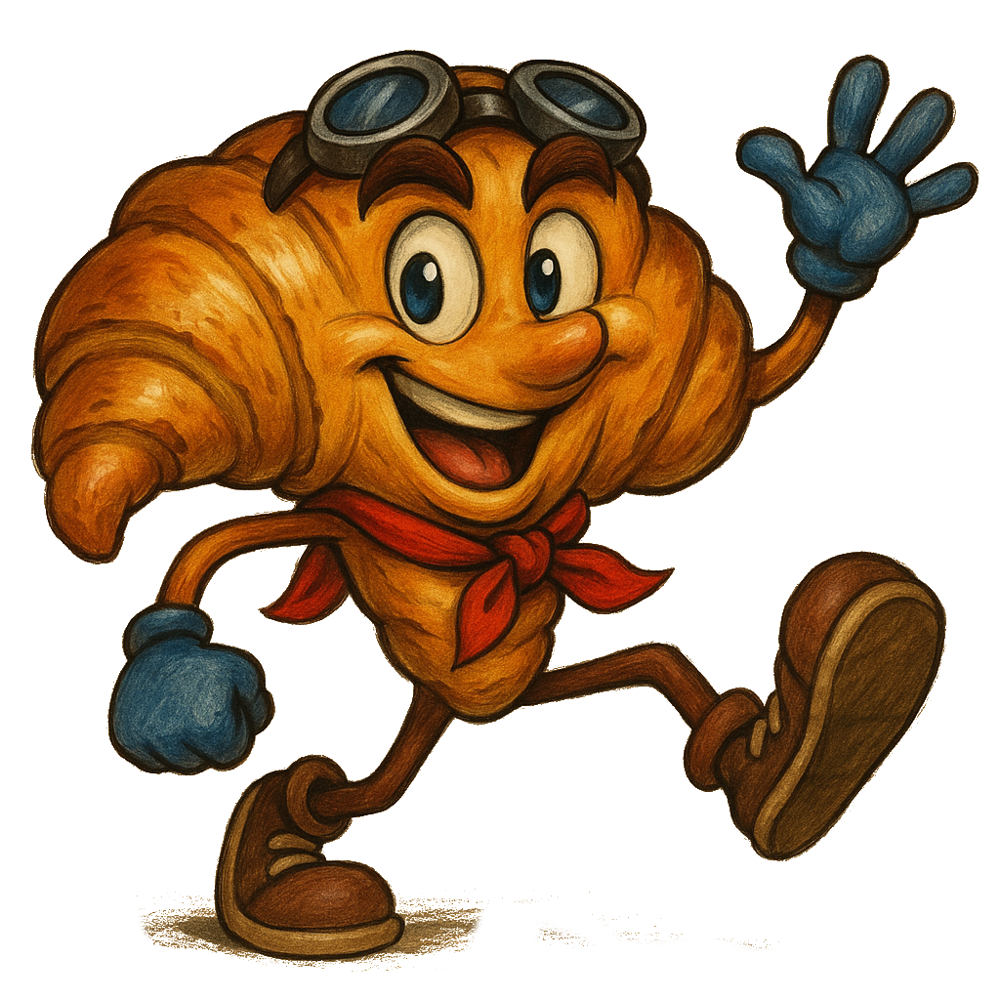

# 🥐 Croissant Adventure 🥐



## ¡Bienvenido a Migalandia!

Croissant Adventure es un proyecto web interactivo que combina múltiples mini-juegos con una interfaz amigable y un asistente de IA en forma de croissant llamado Croissi.

## 🎮 Características Principales

### Sistema de Login y Selección de Personajes
- Interfaz de login atractiva y animada
- Selección de personajes con diferentes opciones
- Persistencia de sesión para guardar la configuración del usuario

### Mundo de Migalandia
- Un hub central desde donde acceder a todas las aventuras
- Interfaz intuitiva con animaciones suaves
- Diseño responsivo adaptado a diferentes dispositivos

### Chat con IA y Asistente Virtual
- Interactúa con Croissi, tu guía en el mundo de Migalandia
- El asistente te recomienda juegos según tus preferencias
- Sistema de detección de menciones para sugerir juegos relacionados

### Colección de Mini-juegos
Disfruta de una amplia variedad de mini-juegos:

1. **🪙 El Tesoro del Valle Dorado** - Un juego de recolección de monedas
2. **🎰 La Rueda de la Fortuna** - Un juego de ruleta para probar tu suerte
3. **♞ El Reino Cuadriculado** - Una versión del clásico ajedrez
4. **🧩 El Bosque Enredado** - Un desafiante laberinto
5. **🔫 El Cielo Azucarado** - Juego de disparos
6. **🏃 Islas Flotantes** - Juego de plataformas
7. **🃏 Las Cartas Gemelas** - Juego de memoria
8. **🐍 Silbi la Serpiente** - Una versión del clásico Snake
9. **🧠 El Cuadro Mágico** - Juego de puzzles
10. **🎵 La Orquesta Dulce** - Juego rítmico
11. **🏰 El Castillo de Azúcar** - Tower Defense
12. **🎣 Pescador Pastelero** - Juego de pesca
13. **🏄 Surfista Glaseado** - Juego de surf

### Características Técnicas
- Desarrollado con HTML5, CSS3 y JavaScript puro
- Diseño responsivo para funcionar en múltiples dispositivos
- Sistema modular de escenas y mini-juegos
- Motor de juego personalizado
- Interfaz de chat integrada

## 🚀 Cómo ejecutar el proyecto

1. Simplemente clona el repositorio:
   ```
   git clone https://github.com/YOUR-USERNAME/CroissantAdventure.git
   ```

2. Abre el archivo `index.html` en tu navegador web preferido

3. Inicia sesión con las credenciales (pista: admin/admin)

4. ¡Explora Migalandia y disfruta de todas las aventuras!

## 🎨 Personajes

El proyecto cuenta con varios personajes, siendo Croissi el croissant el protagonista principal y guía de tus aventuras.

## 🧰 Estructura del Proyecto

```
/
├── index.html         # Página de inicio/login
├── juego.html         # Contenedor principal de juegos
├── juego_nuevo.html   # Versión alternativa del contenedor de juegos
├── css/               # Estilos CSS
├── js/                # Scripts JavaScript
│   ├── minigames/     # Implementación de mini-juegos
│   ├── scenes/        # Escenas del juego
│   └── ai/            # Sistema de chat con IA
└── *.png              # Recursos gráficos
```

## 📝 Licencia

Este proyecto es de código abierto.

## 👨‍💻 Contribuciones

¡Las contribuciones son bienvenidas! Si deseas mejorar Croissant Adventure, no dudes en crear un pull request.

---

Creado con ❤️ y 🥐
